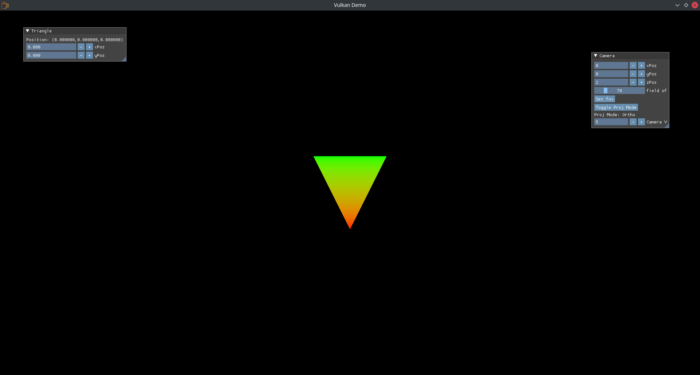

# SDL Vulkan Renderer

This is a sample repository that completes the boilerplate work to get Vulkan set up with SDL2 projects.

### Getting Started

Pull down this repository and open VSCode

Run cmake configure using `cmake-tools` within VSCode

#### Compiling Shaders

Vulkan shaders require to be compiled down to bytecode before they can be used with a Vulkan application.
One such compiler is Google's `glslc` tool, which should come bundled with the Vulkan SDK. If you do not have it installed then you will need to install it on your environment. Please take a look on the internet how to install it
on your system.

To compile the shaders, simply run `bash ./scripts/compile-shaders.sh` if on *nix systems and `./scripts/compile-shaders.bat` if on Windows. You will then need to copy over the .spv binaries into the directory with the HelloVulkan executable. On Linux this will simply just be `./build` and on Windows it will be `./build/Release` or `./build/Debug` depending on your cmake configuration. On MacOS this step is a little more tricky because of the nature of .app bundles therefore a cmake install script has been made to simplify the installation of shaders on MacOS. More info on how to install them below...

If on Apple, you will need to run the following command to install Resources and Frameworks to the App Bundle

```sh
cmake -P ./build/cmake_install.cmake
```

You will then have the proper ICD files and dylibs located where they are required in order to run a Vulkan application on MacOS. This is required as Apple does not support Vulkan natively, and needs to leverage the MoltenVK loader at runtime, which will translate the Vulkan API calls to Metal API calls. On Windows and Linux, it is expected that the end user will user will have Vulkan installed at the system level by their GPU driver.

Run cmake build using `cmake-tools` within VSCode.

The application should boot up and display a black window, with a triangle rendered in Orthographic mode at a scale of 1. 
You can adjust it as you see fit using ImGui widgets.


