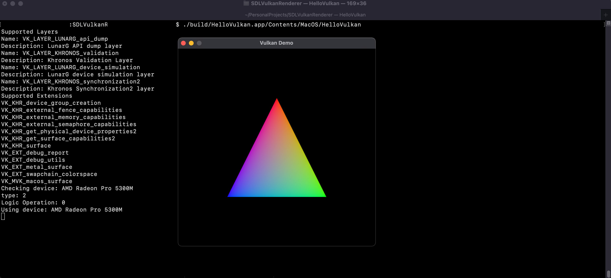

# SDL Vulkan Renderer

This is a sample repository that completes the boilerplate work to get Vulkan set up with SDL2 projects.

### Getting Started

Pull down this repository and open VSCode

Run cmake configure using `cmake-tools` within VSCode

If on Apple, you will need to run the following command to install Resources and Frameworks to the App Bundle

```sh
cmake -P ./build/cmake_install.cmake
```

You will then have the proper ICD files and dylibs located where they are required in order to run a Vulkan application on MacOS. This is required as Apple does not support Vulkan natively, and needs to leverage the MoltenVK loader at runtime, which will translate the Vulkan API calls to Metal API calls. On Windows and Linux, it is expected that the end user will user will have Vulkan installed at the system level by their GPU driver.

Run cmake build using `cmake-tools` within VSCode.

The application should boot up and display a black (or empty on Linux) window with a size 500x500.


